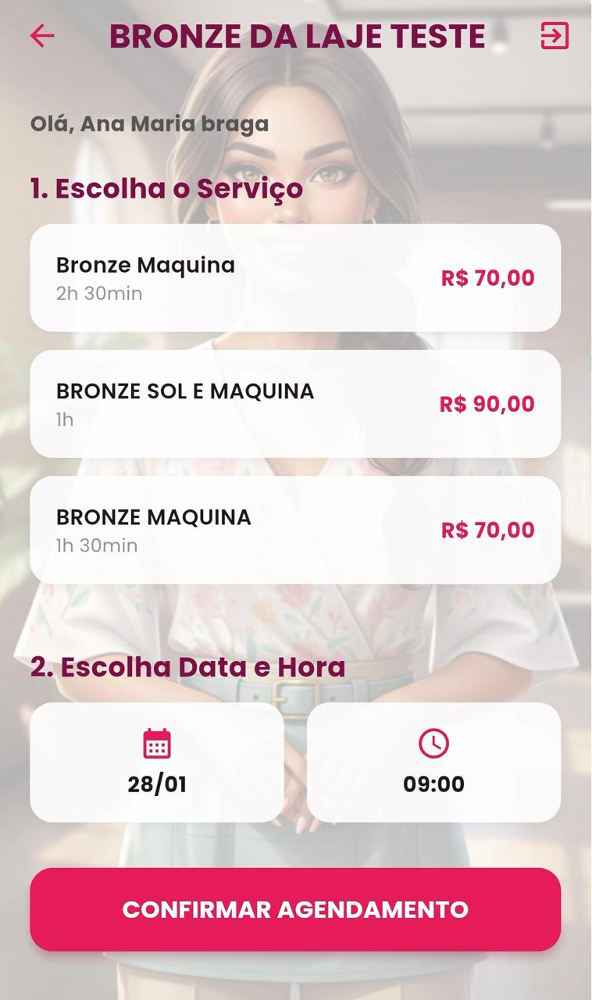
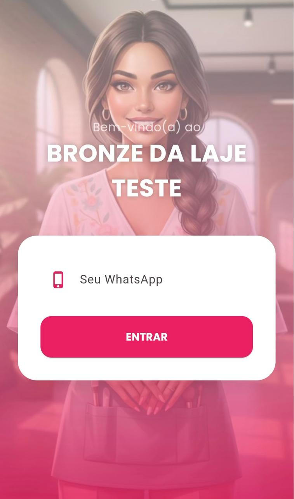
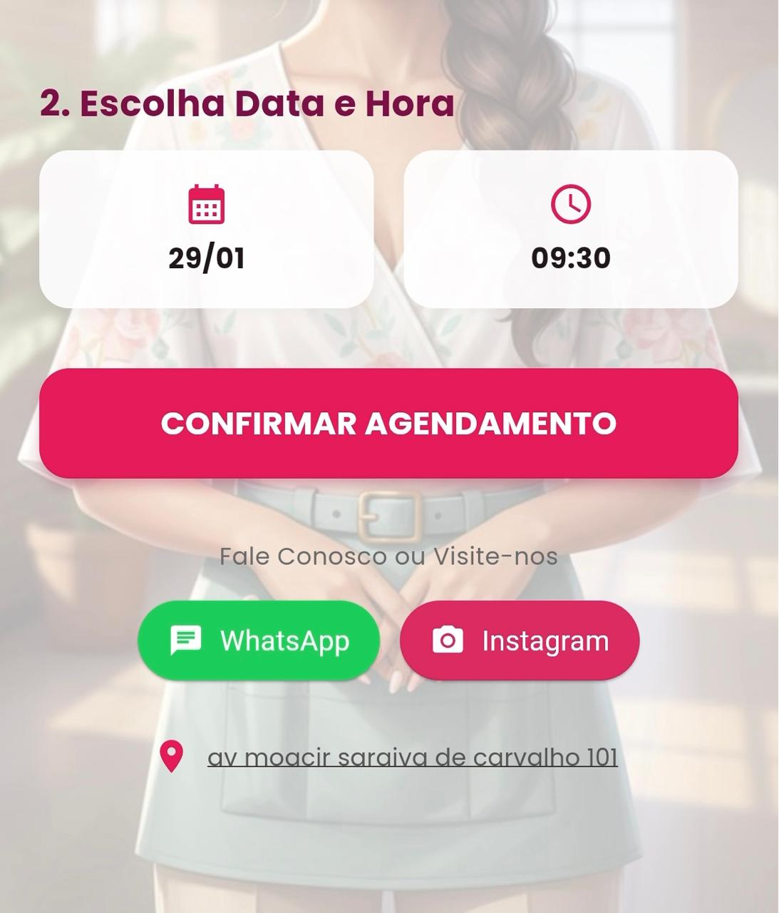

# BelezaSaaS - App do Cliente (Agendamento)

Aplicativo desenvolvido em **Flutter** focado na experiência do cliente final. Este app permite que os clientes acessem a página exclusiva de um estabelecimento (via Link ou QR Code), identifiquem-se e realizem agendamentos de forma rápida e intuitiva.

## 📱 Funcionalidades Principais

### 🔗 Acesso Inteligente (Smart Routing)
* **Link Direto:** Suporte a rotas dinâmicas (ex: `belaagenda.com/#/nomedaloja`) para abrir diretamente no salão correto.
* **Memória de Acesso:** O app "lembra" qual foi o último salão visitado, eliminando a necessidade de digitar o nome novamente.
* **Busca Manual:** Caso o cliente não tenha o link, uma interface amigável permite digitar o ID da loja.

### 📅 Fluxo de Agendamento
* **Catálogo Visual:** Listagem de serviços com preços e duração formatada (ex: "1h 30min").
* **Seleção de Horário:** Calendário e Relógio intuitivos para escolha da data.
* **Identificação Simplificada:** Login apenas com Nome e WhatsApp (sem senhas complexas).

### 📍 Integração com o Salão
* **Botões de Ação:** Links diretos para o WhatsApp, Instagram e Google Maps do estabelecimento.
* **Status em Tempo Real:** Feedback imediato sobre o status da solicitação de agendamento.

## 🚀 Tecnologias Utilizadas

* **Flutter** (Web PWA & Mobile)
* **Dart** (Lógica de Rotas e Negócio)
* **Dio** (Conexão HTTP com API Django)
* **Shared Preferences** (Cache local para memória da loja)
* **Intl** (Formatação de datas e moeda BRL)
* **Url Launcher** (Integração com Apps externos)

## 📸 Screenshots

  
  
  

